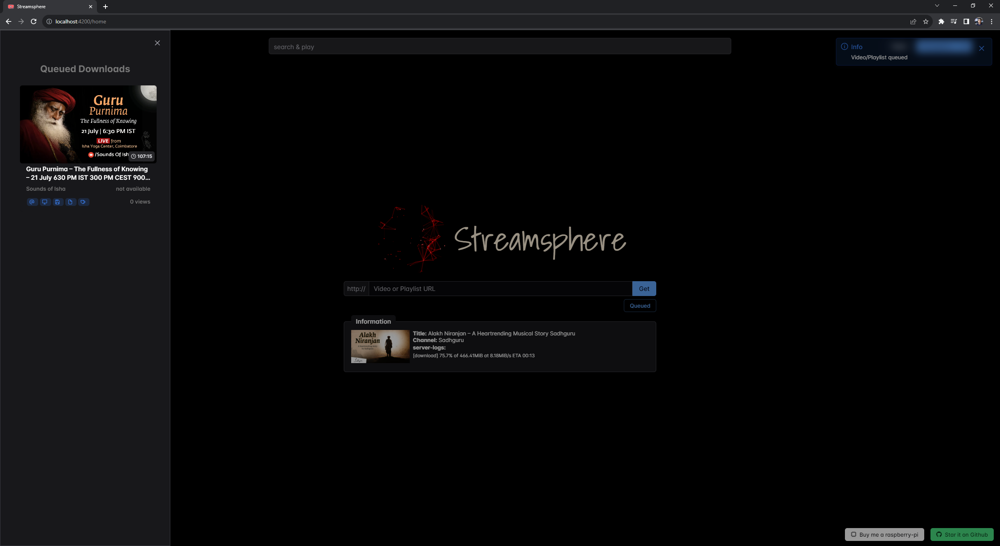
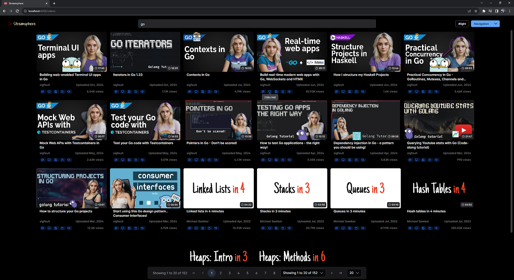
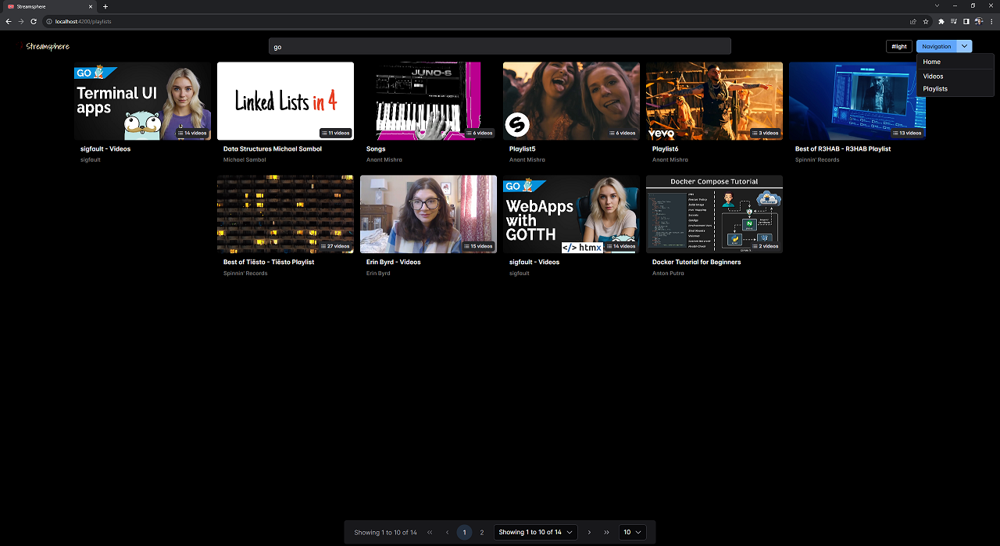

# Streamsphere

It serves as a media library that you can build from yt. It is a front-end for yt-dlp. It supports channels, playlists and videos from yt.
> *Note: The tool is under active development. Please see open tickets for upcoming features.* 

## Interface

| --------------------------------------------------------- | --------------------------------------------------------- | 
|       |                    | 
|         |   | 

